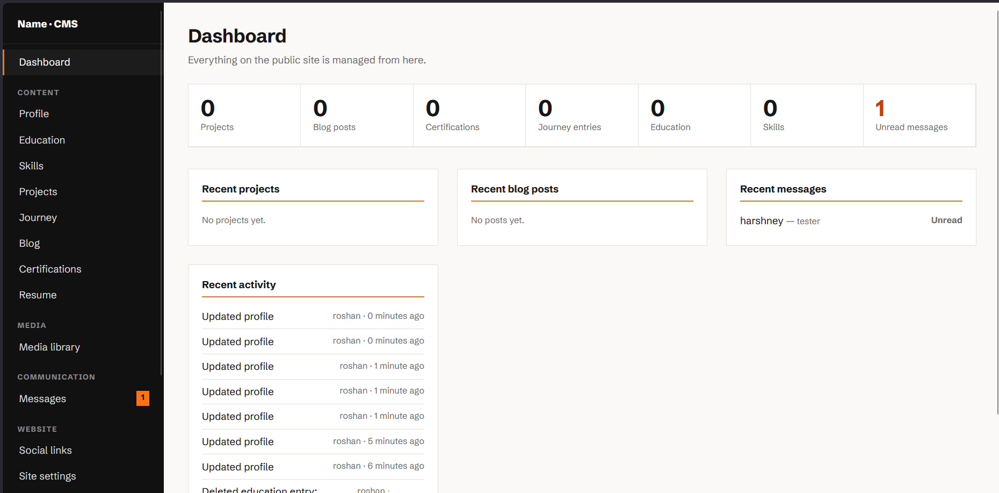
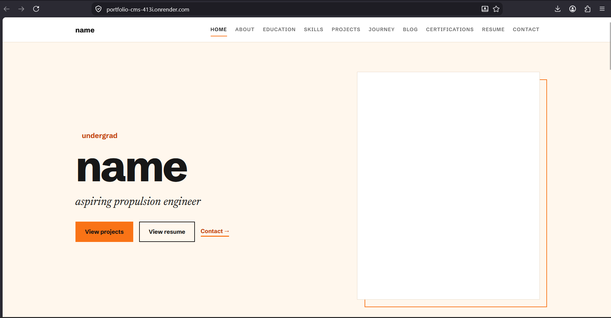
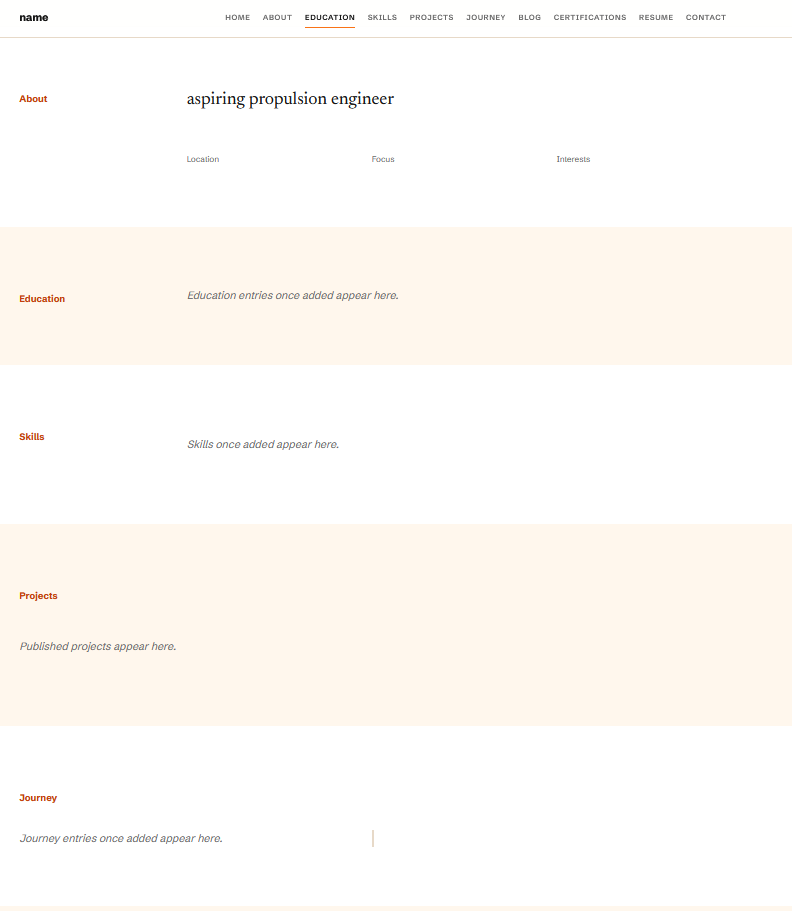
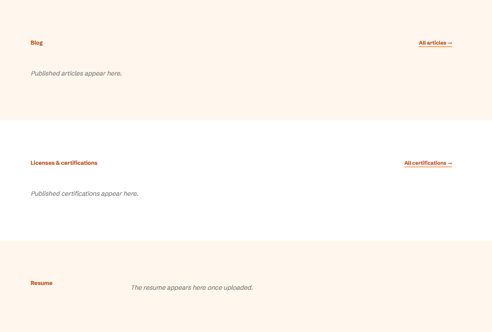
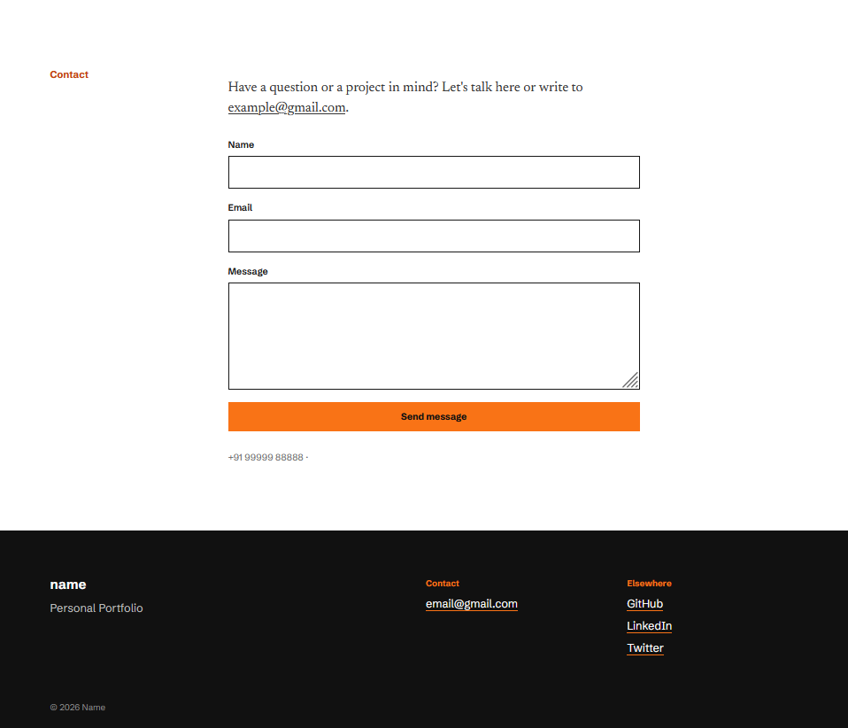

# Portfolio + CMS
Personal portfolio with its own content-management panel.

### Deployed at [https://portfolio-cms-413i.onrender.com/]


## CMS




## Portfolio - Hero Section
(Remaining pics at the end.)




## Flow

| Public site | CMS at `/cms/` |
|---|---|
| Hero, About, Education, Skills | Dashboard with live stats and recent activity |
| Projects with full case-study pages | Add / edit / delete / reorder everything |
| Journey timeline with photos | Draft → publish → unpublish for blog posts |
| Blog with draft and publish | Multi-screenshot uploads per project |
| Certifications with an in-page PDF viewer | **Media library** for images and PDFs |
| Resume viewer (open or download) | Messages inbox (read / unread) |
| Contact form, sitemap, SEO and Open Graph tags | Social links, SEO, favicon, footer |


## Stack

| | |
|---|---|
| Backend | Django 5.2, server-rendered templates |
| Database | SQLite locally, PostgreSQL (Neon) via `DATABASE_URL` |
| Files | Local `media/` or any S3-compatible bucket (Supabase, Neon, R2) |
| Hosting | Gunicorn + WhiteNoise; free-tier ready for Render |
| Frontend | Plain CSS and a tiny bit of vanilla JS |


## Project Directory

```
config/      settings and root URLs
core/        models, public views, CMS views, validators, storage, seed command
templates/   public/ and cms/ pages
static/      site.css, cms.css, small JS files
```


## Complete Walkthrough 

### CMS


### Portfolio Site - Hero







### Contact Form


